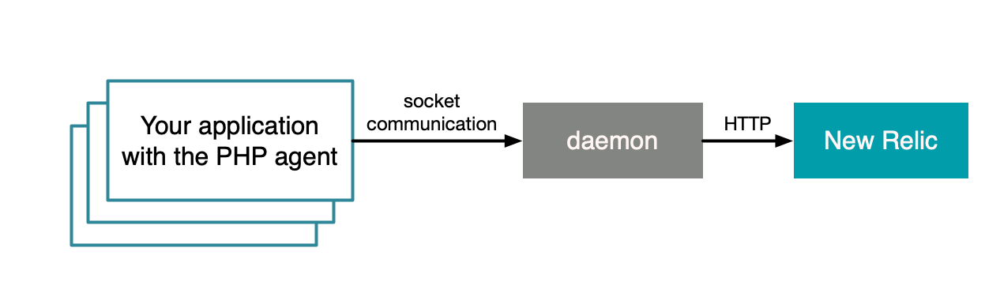

<a href="https://opensource.newrelic.com/oss-category/#community-plus"><picture><source media="(prefers-color-scheme: dark)" srcset="https://github.com/newrelic/opensource-website/raw/main/src/images/categories/dark/Community_Plus.png"><source media="(prefers-color-scheme: light)" srcset="https://github.com/newrelic/opensource-website/raw/main/src/images/categories/Community_Plus.png"></picture></a>

# New Relic PHP agent 

The [New Relic APM PHP agent](https://docs.newrelic.com/docs/agents/php-agent/getting-started/introduction-new-relic-php) monitors your application to help you identify and solve performance issues. The PHP agent consists of a PHP extension (which collects data from your application) and a local proxy daemon (which transmits the data to New Relic).

## Installation

The PHP agent supports many of the most common PHP releases, PHP frameworks, databases, and libraries. Prior to installation, please ensure your system meets the [compatibility requirements](https://docs.newrelic.com/docs/agents/php-agent/getting-started/php-agent-compatibility-requirements).

To get started with installation, see the PHP Agent [installation](https://docs.newrelic.com/docs/agents/php-agent/installation/php-agent-installation-overview) documentation. The PHP agent pre-built package includes the interactive [`newrelic-install`](https://docs.newrelic.com/docs/agents/php-agent/advanced-installation/using-newrelic-install-script) script, which automates some installation tasks. Also, see our [advanced installation documentation](https://docs.newrelic.com/docs/agents/php-agent/advanced-installation/docker-other-container-environments-install-php-agent) for Docker or other container installations.

## Getting Started

See our [Introduction to New Relic for PHP](https://docs.newrelic.com/docs/agents/php-agent/getting-started/introduction-new-relic-php) to learn how to use the PHP agent with your application.

## Building and Testing

For instructions on how to build and test the agent, please see our [development guide](/docs/development.md).

## Support

Should you need assistance with New Relic products, you are in good hands with several support diagnostic tools and support channels.

**Troubleshooting**

For help with framework troubleshooting, this [guide](https://discuss.newrelic.com/t/php-troubleshooting-framework-install/108683) steps you through common framework troubleshooting questions.

New Relic offers NRDiag, a [client-side diagnostic utility](https://docs.newrelic.com/docs/using-new-relic/cross-product-functions/troubleshooting/new-relic-diagnostics) that automatically detects common problems with New Relic agents. If NRDiag detects a problem, it suggests troubleshooting steps. If you have a New Relic Support Plan, NRDiag can also automatically attach troubleshooting data to a New Relic Support ticket.

If the issue is confirmed as a bug or is a feature request, please file a GitHub issue.

**Support Channels**

* [New Relic Documentation](https://docs.newrelic.com/docs/agents/php-agent/getting-started/introduction-new-relic-php): Comprehensive guidance for using our platform
* [New Relic Community](https://forum.newrelic.com/): The best place to engage in troubleshooting questions
* [New Relic Developer](https://developer.newrelic.com/): Resources for building a custom observability applications
* [New Relic University](https://learn.newrelic.com/): A range of online training for New Relic users of every level
* [New Relic Technical Support](https://support.newrelic.com/) 24/7/365 ticketed support. Read more about our [Technical Support Offerings](https://docs.newrelic.com/docs/licenses/license-information/general-usage-licenses/global-technical-support-offerings).

## Privacy

At New Relic we take your privacy and the security of your information seriously. We are committed to protecting your information and must emphasize the importance of not sharing personal data in public forums. We ask all users to scrub logs and diagnostic information for sensitive information, whether personal, proprietary, or otherwise.

We define "Personal Data" as any information relating to an identified or identifiable individual, including, for example, your name, phone number, post code or zip code, Device ID, IP address, and email address.

Please review [New Relic’s General Data Privacy Notice](https://newrelic.com/termsandconditions/privacy) for more information.

## Contributing
We encourage your contributions to improve New Relic's PHP agent! Keep in mind when you submit your pull request, you'll need to sign the CLA via the click-through using CLA-Assistant. You only have to sign the CLA one time per project.
If you have any questions, or to execute our corporate CLA, required if your contribution is on behalf of a company,  please drop us an email at opensource@newrelic.com.

**A note about vulnerabilities**

As noted in our [security policy](https://github.com/newrelic/newrelic-php-agent/security/policy), New Relic is committed to the privacy and security of our customers and their data. We believe that providing coordinated disclosure by security researchers and engaging with the security community are important means to achieve our security goals.

If you believe you have found a security vulnerability in this project or any of New Relic's products or websites, we welcome and greatly appreciate you reporting it to New Relic through [HackerOne](https://hackerone.com/newrelic).

If you would like to [contribute](https://github.com/newrelic/newrelic-php-agent/blob/main/CONTRIBUTING.md) to this project, please review these guidelines.

To all [contributors](https://github.com/newrelic/newrelic-php-agent/graphs/contributors), we thank you! Without your contribution, this project would not be what it is today. We also host a community project page dedicated to the [New Relic PHP agent](https://opensource.newrelic.com/projects/newrelic/newrelic-php-agent).

## License
The PHP agent is licensed under the [Apache 2.0](http://apache.org/licenses/LICENSE-2.0.txt) License and also uses source code from third-party libraries. You can find full details on which libraries are used and the terms under which they are licensed in the third-party notices document.
