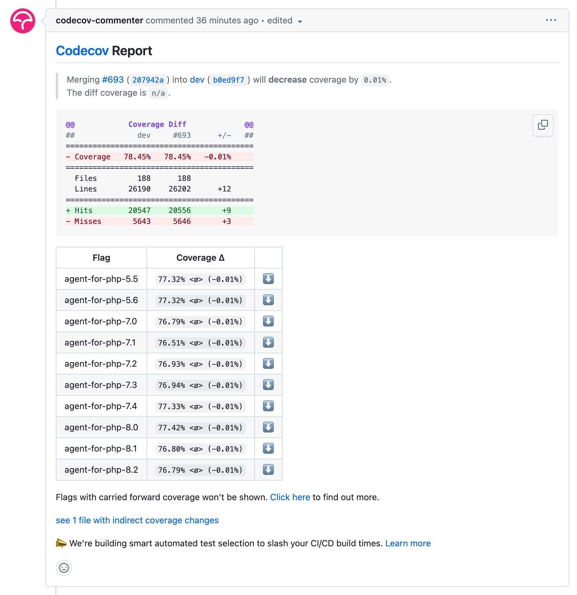

# New Relic PHP Agent code coverage monitoring

New Relic PHP Agent's CI/CD is integrated with [Codecov](https://about.codecov.io/)
to provide insights into agent's automated tests coverage. Insights can be accessed
through via Codecov's dashboard for [`newrelic-php-agent`](https://app.codecov.io/gh/newrelic/newrelic-php-agent).

## Codecov's dashboard for [`newrelic-php-agent`](https://app.codecov.io/gh/newrelic/newrelic-php-agent)

Codecov's dashboard for [`newrelic-php-agent`](https://app.codecov.io/gh/newrelic/newrelic-php-agent) has many
useful views. Here's a list of most useful ones:
* [Coverage by PHP version](https://app.codecov.io/gh/newrelic/newrelic-php-agent/flags)
* [Coverage by pull requests](https://app.codecov.io/gh/newrelic/newrelic-php-agent/pulls)
* [Coverage by commit by branch](https://app.codecov.io/gh/newrelic/newrelic-php-agent/commits)
* [Coverage by file by branch](https://app.codecov.io/gh/newrelic/newrelic-php-agent)

## New Relic PHP Agent's CI/CD integration with [Codecov](https://about.codecov.io/)

New Relic PHP Agent's CI/CD integration with [Codecov](https://about.codecov.io/):
1) establishes a code coverage baseline for long lasting branches which are targets for pull requests,
2) creates pull request comments which allow contributors to quickly analyze the PR's coverage without leaving GitHub's UI.

### Establishing code coverage baseline

The baseline code coverage is used to calculate a pull request's code coverage deltas.
Any branch which is a target for a pull request needs to have a baseline code
coverage established. Otherwise, Codecov's pull request comment will include the
following message:

> :exclamation: No coverage uploaded for pull request base (baseref@baseref-commit-sha). 
[Click here to learn what that means](https://docs.codecov.com/docs/error-reference#missing-base-report).
The diff coverage is `n/a`.

New Relic PHP Agent's CI/CD provides a workflow to generate and upload the baseline code coverage:
[`code-coverage-baseline`](https://github.com/newrelic/newrelic-php-agent/actions/workflows/code-coverage-baseline.yml).
Execute this workflow and it'll upload code coverage report to Codecov's dashboard for
[`newrelic-php-agent`](https://app.codecov.io/gh/newrelic/newrelic-php-agent) for HEAD commit of
selected `origin` and `ref`.

### Pull request comments

[Codecov's pull request comments](https://docs.codecov.com/docs/pull-request-comments)
allow contributors to quickly analyze PR's coverage without leaving GitHub's UI. See example:

Codecov's comments are available in every pull request once
[`test-pull-request`](https://github.com/newrelic/newrelic-php-agent/actions/workflows/test-agent.yml)
workflow completes testing the pull request.

[`test-pull-request`](https://github.com/newrelic/newrelic-php-agent/actions/workflows/test-agent.yml)
is using [build system's support for code coverage profiling](development.md#code-coverage)
to generate [`gcov`](https://gcc.gnu.org/onlinedocs/gcc/Gcov.html) code coverage reports,
and [Codecov GitHub Action](https://github.com/codecov/codecov-action) to upload the reports
to Codecov's dashboard for [`newrelic-php-agent`](https://app.codecov.io/gh/newrelic/newrelic-php-agent).
