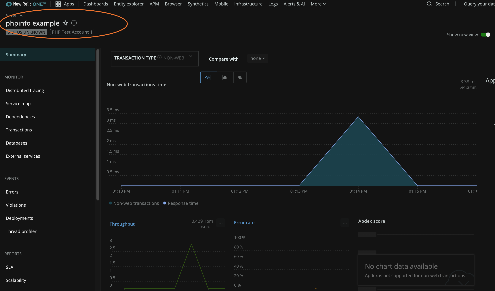
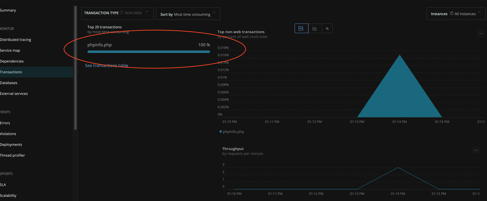

# Development

Here are some instructions for building the New Relic PHP agent yourself.

## Requirements

Check out what's important before you get started:

### Development Platform

Currently, the PHP agent has only been developed and compiled on Linux systems. Below is a partial list of platforms (and their dependences) that the PHP agent can be built on:

[ This will be filled in with the findings from make system investigation ]

### PHP

The PHP agent supports PHP versions `5.3`, `5.4`, `5.5`, `5.6`, `7.0`, `7.1`, `7.2`, `7.3`, and `7.4`.

### Go

Install the [latest version of Go](https://golang.org/dl/). Typically it's installed in `/usr/local/go`. Be sure to extend your **`$PATH`** to include it!

## Build the PHP Agent

Hooray, you've met all the requirements! Now, let's build the agent. From the top level of the PHP agent directory, run `make` to build both the agent and daemon. 

```
make
```

You can find the agent in `agent/.libs/newrelic.so`, and the daemon and associated Go binaries are in `newrelic-php-agent/bin`.

To build the agent and install it to the active PHP installation:

```
make agent-install
```

For this to work with the daemon, copy the daemon binary (found in `newrelic-php-agent/bin`) to `usr/bin/newrelic-daemon`.

### Configuration settings

The PHP agent is configured using a `newrelic.ini` config file. To get started with configuration, you can follow the basic steps below, or you can check out our [detailed documentation](https://docs.newrelic.com/docs/agents/php-agent/configuration/php-agent-configuration).

1. Create your own copy of the template found in `agent/scripts/newrelic.ini.template`. 
2. Insert the `newrelic.ini` file in the same location as your `php.ini` (Running `php --ini` will tell you where that is). 
3. Once your `newrelic.ini` is created and in the correct location, edit the file and add the following:
    * A license key (Insert a valid key: `newrelic.license = "INSERT_YOUR_LICENSE_KEY"`)
    * A unique application name
    * The full path to your daemon
4. Make sure your log directory exists and is read/writable (`/opt/nr/logs` or `/var/log/` are good options). 

**NOTE:** The default log level for both is `info`, but this can be changed in both the [agent](https://docs.newrelic.com/docs/agents/php-agent/configuration/php-agent-configuration#inivar-loglevel) and [daemon](https://docs.newrelic.com/docs/agents/php-agent/configuration/php-agent-configuration#inivar-daemon-loglevel). The more verbose log settings can generate a lot of information very quickly. When necessary, we suggest setting `debug` for short periods of time to identify problems. 

The default configuration settings should work for most cases, but here are some examples of customized settings:

```
newrelic.logfile = "/opt/nr/logs/php_agent.log"
newrelic.appname = "INSERT_YOUR_APP_NAME"
newrelic.daemon.logfile = "/opt/nr/logs/newrelic-daemon.log"
newrelic.daemon.location = "INSERT_THE_PARENT_DIRECTORY_OF_PHP_AGENT/newrelic-php-agent/bin/daemon"
```

Once the agent is compiled, make sure the `newrelic.so` extension you just created is somewhere PHP can see it. You can do this by editing the `extension` setting.

```
extension = "INSERT_THE_PARENT_DIRECTORY_OF_PHP_AGENT/newrelic-php-agent/agent/.libs/newrelic.so"
```

## Testing

The PHP agent unit tests are split into two categories: [agent](../agent/tests) and [axiom](../axiom/tests) unit tests. The agent unit tests contain all of the tests related to PHP instrumentation while the axiom unit tests contain all of the PHP independent tests.

To run both the agent and axiom unit tests:

```
make run_tests
```

Both unit tests can be run under Valgrind to check for memory issues:

```
make valgrind
```

**NOTE:** Although agent integration tests are available, all tests will fail due to internal licensing requirements. This will be changed in the future and will allow integration tests to be run locally by anyone.

## Make

Here is a partial list of Makefile capabilities. All targets should support parallel compilation using `-j`.

### Build commands

|command|function|
|-------|--------|
|`make -j8`|Use 8 CPUs|
|`make agent`|Just build the agent|
|`make agent-install`|Build the agent and install it to the active PHP installation|
|`make daemon`|Build the daemon|

### Test commands

|command|function|
|-------|--------|
|`make run_tests`|Build and run the agent and axiom unit tests (Agent unit tests currently require Linux)|
|`make run_tests TESTS=test_txn`|Run only the `test_txn.c` tests|
|`make run_tests SKIP_TESTS=test_rpm`|Skip the `test_rpm.c` tests|
|`make valgrind`|Build and run the agent tests under valgrind and fail if any memory leaks occur|
|`make agent-valgrind`|Build and run the agent tests under valgrind|
|`make axiom-valgrind`|Build and run the axiom tests under valgrind|
|`make daemon_integration`|Build the daemon unit tests|
|`make daemon_bench`|Run the daemon performance tests|

### Clean commands

|command|function|
|-------|--------|
|`make clean`|Cleans everything! This should return your working directory to a pristine, slightly minty state|
|`make agent-clean`|Just cleans the agent. Useful if you want to build against a different PHP version but don't want to rebuild axiom or the daemon|
|`make axiom-clean`|Just clean axiom|
|`make daemon-clean`|Just clean the daemon|

## Take the agent for a spin

Once the agent (and daemon) are built and [configured](#configuration-settings), monitoring can commence. Below is a quick example to demonstrate instrumentation:

**phpinfo()**

For this example our app is named `phpinfo example`. First, we create a simple `.php` file that contains a call to `phpinfo()`. Next, we run it to start the agent and begin instrumentation. We should be able to see activity in the both the agent and daemon logs at this point. Any PHP program that is run (when the agent is correctly configured) will automatically start the agent and daemon.

```
echo "<?php phpinfo(); ?>" > phpinfo.php
php phpinfo.php # Do this a few times to fully connect
```

Within a few minutes, the application should be available in your New Relic account. Navigate to the [APM Summary](https://docs.newrelic.com/docs/apm/apm-ui-pages/monitoring/apm-summary-page-view-transaction-apdex-usage-data) page in New Relic One to view your instrumented application.



The [transaction page](https://docs.newrelic.com/docs/apm/apm-ui-pages/monitoring/transactions-page-find-specific-performance-problems) lists the your app's transaction requests, the top five transactions by percent of wall-clock time, and relevant throughputs (requests per minute or rpm). This helps you identify transactions that may be good candidates for fine-tuning performance problems or resolving errors.



### Start the daemon manually

You can start the daemon manually or via the agent (the previous example had the agent start the daemon). To start it manually, tell the daemon not to launch automatically in your `newrelic.ini` with `newrelic.daemon.dont_launch = 3` and start it with appropriate flags. See our [daemon .ini](https://docs.newrelic.com/docs/agents/php-agent/configuration/php-agent-configuration#inivar-daemon-settings) and [newrelic.cfg](https://docs.newrelic.com/docs/agents/php-agent/configuration/proxy-daemon-newreliccfg-settings) settings for more information.

```
./bin/daemon -f -logfile stdout -loglevel debug
```

## PHP Agent API

The PHP agent API allows you to extend the functionality of the PHP agent. The agent API is included by default with your installation, so no additional configuration is required to use the agent.

Among other things, you can use the API to:

    * Customize your app name
    * Collect errors 
    * Record custom attributes, custom events, and custom metrics
    * Enable or disable browser monitoring 
    
For an introduction to this API, see our guide to the [PHP agent API](https://docs.newrelic.com/docs/agents/php-agent/api-guides/guide-using-php-agent-api).

## Troubleshooting

If you are having issues with the PHP Agent, our [troubleshooting documents](https://docs.newrelic.com/docs/agents/php-agent/troubleshooting) are a great starting point.